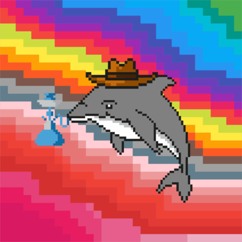
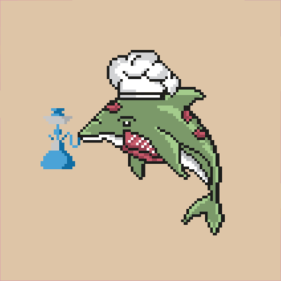

# NFT Image Generator

This project is an NFT generator that combines multiple traits to generate unique images and corresponding metadata based on a YAML configuration file. All images were designed by the project creator.
Run the Program: The main entry point, main(), initiates image and metadata generation.




kotlin

```kotlin
fun main() {
    generateImages()             // Generates image combinations based on traits
    saveMetadata()               // Saves metadata in JSON format
    generateAndSaveImages()      // Creates and saves images as PNG files
    generateIndividualMetadata() // Creates individual JSON metadata files for each image
}
```
Or
``./gradlew run ``

### Main Directories

- **src/main/resources/trait-layers**  
  Directory containing folders for each trait type (e.g., `backgrounds`, `hats`, `bases`, `smoke_attributes`). Each folder holds PNG files for different traits that are layered to create the final image.

- **src/main/resources/metadata**  
  Stores metadata files for each generated image:
    - `all-traits.json`: Contains metadata for all generated images in this format:
      ```json
      {
        "bases": "normal",
        "hats": "hat_chef",
        "backgrounds": "peach",
        "smoke_attributes": "cigarette",
        "tokenId": "0"
      }
      ```

- **src/main/resources/images**  
  Contains the generated images in PNG format.

# Configuration
Define your traits and their weights in the config.yaml file. This file controls which traits are used in image generation.

```yaml
project:
  imageBaseUrl: "ADD_IMAGES_BASE_URI_HERE"
  name: "ADD_PROJECT_NAME_HERE"

traits:
  backgrounds:
    values: ["peach", "yellow", "rainbow"]
    weights: [70, 15, 15]
  hats:
    values: ["hat_chef", "hat_cowboy", "hat_gentleman", "hat_king", "hat_master", "hat_nurse", "hat_policeman", "hat_santa", "hat_turkish", "hat_wizard"]
    weights: [10, 10, 10, 10, 10, 10, 10, 10, 5, 5]
  smoke_attributes:
    values: ["cradle", "cigarette", "shisha"]
    weights: [30, 40, 30]
  bases:
    values: ["zombie", "normal", "dragon", "alien"]
    weights: [30, 40, 20, 10]
```
# Adding New Traits
To add new traits, modify config.yaml. For example, adding a new background color and adjusting weights:
```yaml
backgrounds:
  values: ["peach", "yellow", "rainbow", "green"]
  weights: [70, 15, 15, 10]
```

# Example Metadata JSON
Each generated metadata file contains an image URL, token ID, project name, and trait attributes

```json
{
  "image": "ADD_IMAGES_BASE_URI_HERE/1.png",
  "tokenId": "1",
  "name": "ADD_PROJECT_NAME_HERE 1",
  "attributes": [
    { "trait_type": "backgrounds", "value": "yellow" },
    { "trait_type": "hats", "value": "hat_chef" },
    { "trait_type": "bases", "value": "normal" },
    { "trait_type": "smoke_attributes", "value": "cigarette" }
  ]
}
```

# Notes
* All trait images must be placed in the respective folders within trait-layers.
* TOTAL_IMAGES in the code specifies the number of unique images to generate.
* Images and metadata are saved in src/main/resources/images and src/main/resources/metadata respectively.

Enjoy creating unique NFT art!# nft-image-generator
